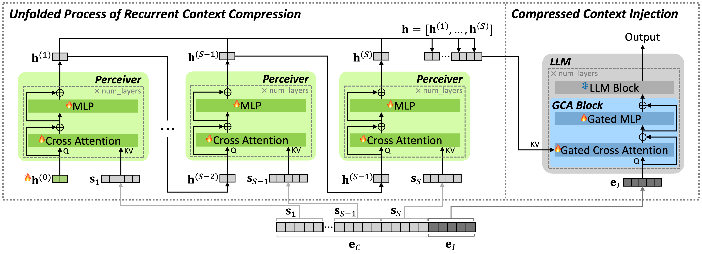

<div style="display: flex; justify-content: center; align-items: center; gap: 50px;">
  
  <a href="https://miil.korea.ac.kr/" target="_blank">
    
  </a>
</div>

# LCIRC: A Recurrent Compression Approach for Efficient Long-form Context and Query Dependent Modeling in LLMs (NAACL 2025)

[[arXiv](https://arxiv.org/abs/2502.06139)] [[Project](https://ssuminan.github.io/LCIRC/)] [[Dataset](https://huggingface.co/datasets/ssumin/fineweb-lqa)] <br>

by [Sumin An](https://github.com/ssuminan), [Junyoung Sung](), [Wonpyo Park](), [Chanjun Park](https://parkchanjun.github.io/)†, [Paul Hongsuck Seo](https://phseo.github.io/)†

This is the official implementation of LCIRC: A Recurrent Compression Approach for Efficient Long-form Context and Query Dependent Modeling in LLMs accepted at **NAACL 2025**!

## Introduction

We introduce LCIRC, a method for efficiently extending the context length of pre-trained LLMs via recurrent compression, and its advanced variant, QD-LCIRC, which utilizes query-dependent recurrent compression for enhanced long-form context modeling.

For further details, please check out our [paper](https://arxiv.org/pdf/2502.06139) and our [project page](https://ssuminan.github.io/LCIRC/).

## :fire:TODO
- [x] Release the code
- [x] Release the dataset
- [ ] Pre-trained weights

## Installation
```bash
docker pull pytorch/pytorch:2.2.1-cuda12.1-cudnn8-devel
docker run --ipc=host --shm-size=10g --gpus all -it --name lcirc2 pytorch/pytorch:2.2.1-cuda12.1-cudnn8-devel
apt-get install git
git clone https://github.com/ssuminan/LCIRC.git
pip install -r requirements.txt
cd LCIRC
```

You need permission to access the [Llama-2-7b](https://huggingface.co/meta-llama/Llama-2-7b) model.

## Data Preparation
You can use [FineWeb-Edu-Long](https://huggingface.co/datasets/ssumin/fineweb-edu-long) and [FineWeb-LQA](https://huggingface.co/datasets/ssumin/fineweb-lqa) on HuggingFace.

### FineWeb-Edu-Long
```bash
from datasets import load_dataset

# training data
train_dataset = load_dataset("ssumin/fineweb-edu-long", split="train")

# valiation data
valid_dataset = load_dataset("ssumin/fineweb-edu-long", split="validation")

# test data
test_dataset = load_dataset("ssumin/fineweb-edu-long", split="test")
```

### FineWeb-LQA
```bash
from datasets import load_dataset

# training data
train_dataset = load_dataset("ssumin/fineweb-lqa", split="train")

# validation data
valid_dataset = load_dataset("ssumin/fineweb-lqa", split="validation")
```

## Training
You can train models as follows:

```bash
CUDA_VISIBLE_DEVICES=[GPU_IDS] python -m torch.distributed.launch --nproc_per_node=[NUM_GPUS] [FILE_NAME].py

# For LCIRC
CUDA_VISIBLE_DEVICES=0,1,2,3,4,5,6,7 python -m torch.distributed.launch --nproc_per_node=8 train_LCIRC.py

# For QD-LCIRC
CUDA_VISIBLE_DEVICES=0,1,2,3,4,5,6,7 python -m torch.distributed.launch --nproc_per_node=8 train_QDLCIRC.py
```

## Evaluation
You can evaluate models as follows:

```bash
CUDA_VISIBLE_DEVICES=[GPU_ID] python eval/evaluation.py\
--benchmark [BENCHMARK_NAME]\
--model_id meta-llama/Llama-2-7b-hf\    # backbone model
--batch_size [BATCH_SIZE]\
--subtasks [SUBTASK_NAME]\
--query_dependent\                      # if query dependent model
--cp_path [CHECKPOINTS]\
--model_name [MODEL_NAME] >> [TEXT_FILE_NAME].txt

# For LCIRC
CUDA_VISIBLE_DEVICES=0 python eval/evaluation.py\
--benchmark longbench\
--model_id meta-llama/Llama-2-7b-hf\
--batch_size 1\
--subtasks narrativeqa\
--cp_path LCIRC_checkpoint_epoch0_2000.pt\
--model_name LCIRC >> LCIRC_narrativeqa.txt

# For QD-LCIRC
CUDA_VISIBLE_DEVICES=0 python eval/evaluation.py\
--benchmark longbench\
--model_id meta-llama/Llama-2-7b-hf\
--batch_size 1\
--subtasks narrativeqa\
--query_dependent\
--cp_path QDLCIRC_checkpoint_epoch0_2000.pt\
--model_name QD_LCIRC >> QD_LCIRC_narrativeqa.txt
```

## Acknowledgement
We acknowledge the contributions of publicly available projects, such as [Transformers](https://github.com/huggingface/transformers/tree/v4.49.0/src/transformers/models/llama), [LLaMA](https://github.com/meta-llama/llama), and [Flamingo-PyTorch](https://github.com/lucidrains/flamingo-pytorch), whose code has been utilized in this repository.

## Bug or Questions?
If you have any questions, feel free to email Sumin (`suminan@korea.ac.kr`).
If you come across any issues or bugs while using the code, you can open an issue.
Please provide detailed information about the problem so we can assist you more efficiently!

## Citation
```BibTeX
@article{an2025lcirc,
  title={LCIRC: A Recurrent Compression Approach for Efficient Long-form Context and Query Dependent Modeling in LLMs},
  author={An, Sumin and Sung, Junyoung and Park, Wonpyo and Park, Chanjun and Seo, Paul Hongsuck},
  journal={arXiv preprint arXiv:2502.06139},
  year={2025}
}
```